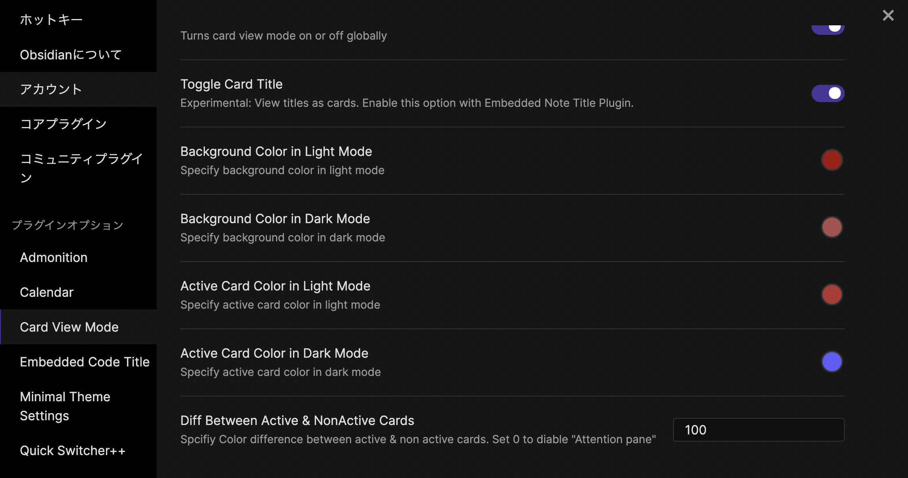

# Obsidian Card View Mode

## Feature1. Card view 

This feature is inspired by Scrapbox(web-based wiki tool) & Zettelkasten method(slipbox) by Niklas Luhmann.

I found all of the notes are not in the same stage while developing. We need some ways to distinguish them. The card view feature is one way to weigh notes and express them.

The vertical size of each note (a.k.a card) can be expanded or reduced based on the amount of content on them. At a glance, you can easily find how mature your note is at the early stage of note-making or note-developing.

I highly recommend you to use this snippet with the Sliding Pane plugin. I made this to be compatible with that plugin and the Embedded Note Titles plugin.

## Feature2. Attention Pane

Another feature is “Attention Pane”. An active pane card is highlighted and the others are grayed out. This enables you to find an active pane easily and focus on the note. Literally, you can pay attention to the specific pane among many notes!!

## Other Features

Card colors and background color are configurable in the settings tab.

# Development

Special thanks to these plugins! I used these plugins as a reference for developping of my first pubilc plugin. The basic sturucture is mainly based on Sliding Pane. I refered other plugins to build the color configuration system.

- [Sliding Panes (Andy Matuschak Mode) Obsidian Plugin](https://github.com/deathau/sliding-panes-obsidian) by deathau
- [Obsidian Admonition](https://github.com/valentine195/obsidian-admonition) by valentine195
- [Minimal Theme](https://github.com/kepano/obsidian-minimal-settings) by kepano
- [Obsidian Embedded Code Title Plugin](https://github.com/tadashi-aikawa/obsidian-embedded-code-title) by tadashi-aikawa

## How to build manually

- Clone this repo
- `npm i` or `yarn` to install dependencies
- `npm run dev` to compile
- Copy `manifiest.json`, `main.js` and `styles.css` to a subfolder of your plugins folder
- Reload obsidian to see changes

## Original CSS
[Gist Link](https://gist.github.com/yo-goto/742906c6463310e3f4e18c745dede016)